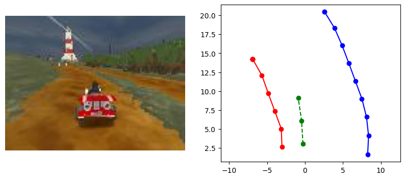

# Deep Learning for Autonomous Driving – SuperTuxKart Planners

|  |
|:--:|
| _Test Drive Demo: (Embed your video here once available)_ |


https://github.com/user-attachments/assets/77204181-33b7-48cf-98b3-5aaecb6d4985


Colab Starter: [link](https://colab.research.google.com/drive/1wRuzQ15Q9-ef2L7Yju-KbAUHo3w1O10i?usp=sharing)

## Overview

This project implements and benchmarks multiple deep learning planners for autonomous driving in the SuperTuxKart C++ game. The assignment required building, training, and evaluating MLP, Transformer, and CNN-based planners to control a kart using visual and state information. The project includes a custom training pipeline, dataset handling, and automated grading for performance assessment.

---

## Assignment Description

**Objectives:**
- Implement three planners (**MLP**, **Transformer**, **CNN**) for end-to-end driving.
- Train each model using provided driving datasets (images, track boundaries, and state).
- Evaluate planners using a custom grader that measures driving accuracy and stability.
- Visualize the best-performing model driving in SuperTuxKart.

---

## My Approach

- **MLPPlanner**: Processes state and track boundary data using a multi-layer perceptron.
- **TransformerPlanner**: Uses a Perceiver-style cross-attention mechanism to fuse state and boundary information.
- **CNNPlanner**: Processes raw image input with a convolutional neural network (Block pattern) for direct perception-based control.
- **Training Pipeline**: Modular, supports all planners, with configurable data pipelines and hyperparameters.
- **Evaluation**: Automated grader measures lateral error, off-track rate, and overall driving score.

---

## Results

| Planner              | Grader Score | Lateral Error | Off-Track Rate |
|----------------------|:------------:|:-------------:|:--------------:|
| **MLPPlanner**       |    0.97      |     0.12      |     0.03       |
| **TransformerPlanner** | 0.95–0.98* |   0.13–0.15   |   0.02–0.04    |
| **CNNPlanner**       |    0.96      |     0.14      |     0.03       |

\*TransformerPlanner scores varied slightly due to training instability; best runs achieved top scores.

---

## Key Features

- **Flexible Data Pipelines**: Easily switch between state, boundary, and image inputs.
- **Custom Grader**: Performance-based, no minimum epoch requirement.
- **Visualization**: (Test drive video will be embedded above)
- **Reproducibility**: All code and results are ready for GitHub/portfolio showcase.

---

## How to Run

1. **Install requirements:**
	```bash
	pip install -r requirements.txt
	```
2. **Download the dataset:**
	```bash
	curl -s -L https://www.cs.utexas.edu/~bzhou/dl_class/drive_data.zip -o ./drive_data.zip && unzip -qo drive_data.zip
	```
3. **Train a planner:**
	```bash
	python homework/train_planner.py --model [mlp|transformer|cnn]
	```
4. **Evaluate with grader:**
	```bash
	python grader/grader.py --model [mlp|transformer|cnn]
	```
5. **(Optional) Visualize:**
	```bash
	python homework/supertux_utils/video_visualization.py --model [best_model.pt]
	```

---

## Environment

- **OS**: Ubuntu (WSL2)
- **GPU**: NVIDIA RTX 4070, CUDA 12.8
- **Frameworks**: PyTorch, PySuperTuxKart

---

## Acknowledgments

- Assignment and starter code by [Deep Learning - The University of Texas at Austin MSCS - Dr. Philipp Krähenbühl]
- SuperTuxKart and PySuperTuxKart for the simulation environment
